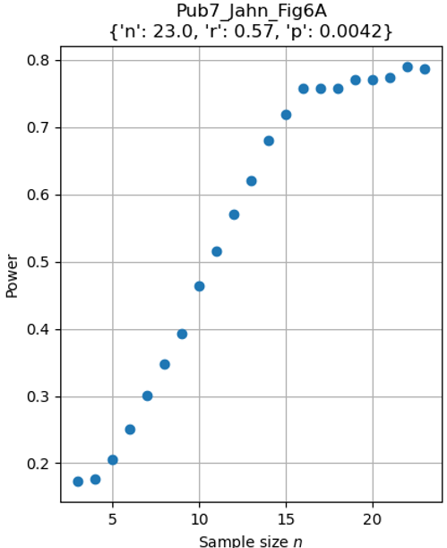

# Statistical power and sample size estimation using a bootstrap monte carlo approach

Using data from publications evaluating the dose-response between absorbed tumour dose (AD) and radiological response 
after 177Lu-Dotatate [peptide-receptor radionuclide therapy (PRRT)](https://en.wikipedia.org/wiki/Peptide_receptor_radionuclide_therapy) of gastroenteropancreatic neuroendocrine tumours (GEP-NETs).

10 publications were considered (not finished):
1. Hebert et al, 2024, JNM, https://doi.org/10.2967/jnumed.123.267023
2. x
3. x
4. x
5. x
6. x
7. Jahn et al, 2021, Cancers, https://doi.org/10.3390/cancers13050962
8. x
9. x
10. x

Development of the method including some other considerations may be found in the dev-files, including the 
jupyter notebook [dev_sample_size_est_pub1.ipynb](dev_sample_size_est_pub1.ipynb), using data extracted from pub 1 figure 3.


## Replication of data
The data were mined from figures, or simply collected from tables. Extracted data are found as .csv in the folder 
data/pubX and loaded using functions in utils_load.py. Replicated figures along results are found in the figures folders.

**Publication 7 as example**: Running the script [pub7.py](pub7.py)

- First a generator of extracted points from the four figures are loaded using the function **load_pub7(folder_data)** from [utils_load.py](utils_load.py)
- Figure 6A is replicated using extracted points. 

```python
compute_bootstrapped_params(x_orig, y_orig, stat_names, stat_func, path_save=path_save, n_min=3, n_rep=1000, nm=nm)
```


Note that the pearson correlation coefficient vary somewhat to the original (R2 of 0.33 versus 0.37), but the p-value is similar.


## Repeated subsampling to evaluate power
Replaced subsamples (bootstraps) of size n=3 to original N were repeatedly sampled 1000 times to evaluate the rate of
statistical significance under the reported success criteria (statistical power), i.e. a monte-carlo approach. If the success criterie were not reported in the study the type I error rate acceptance of p < .05 were used.

Publication 7 uses a double criteria: both $R^2 \geq 0.25$ and p < .05
<br>
This criteria is specified in the _stat_sign_ function, and used as an input parameter in the function _analyze_bootstrapped_params_.

```python
stat_sign = lambda p1, p2: p1 ** 2 >= .25 and p2 < .05

fig, ax = plt.subplots()
analyze_bootstrapped_params(path_save, stat_sign, nm=nm, plot=(fig, ax[i]))

```




Evaluating the figure, it seems to converge to a power around 0.8 when approaching the original sample size (n=23), 
suggesting this is a representative power of the study.

## Extrapolation to higher population sizes
Instead of over-sampling the original data, the power / sample-size relationship is modelled using a 
logarithmic function. Thus enabling a coarse estimate of the required sample size to reach a desired power. 

```python
analyze_bootstrapped_params(path_save, stat_sign, nm=nm, plot=(fig, ax[i]), fit=True, desired_power=0.9)
```


